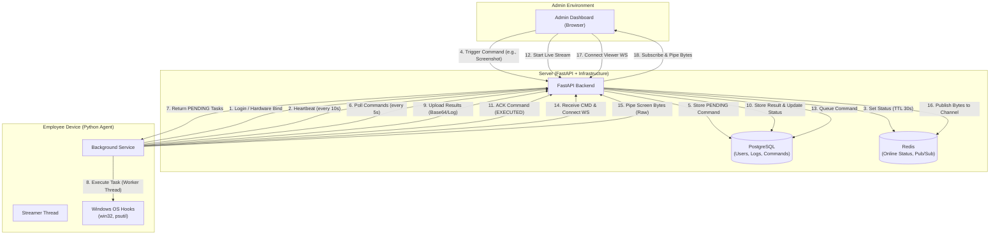

# Employee Monitoring System - Project Specification

## 2. System Architecture & Detailed Flow

### Data Flow Lifecycle

1.  **Presence (Heartbeat)**: Agent hits `/heartbeat` every 10s; API updates Redis (`online:{user_id}`) with a 30s TTL.
2.  **Remote Tasks**: Admin sends command -> API stores `PENDING` in DB -> Agent polls and receives task -> Agent executes using Windows Hooks -> Agent uploads result -> API updates DB and marks as `EXECUTED`.
3.  **Live Streaming**: Admin triggers stream -> Agent receives command and opens a WebSocket to `/ws/live` -> Agent pipes raw bytes -> API publishes to Redis Pub/Sub -> Admin connects Viewer WebSocket -> API relays bytes from Redis to Admin browser.

## 3. Technical Stack

### Backend API (`API master`)
-   **Language**: Python 3.10+
-   **Framework**: FastAPI
-   **Database**: PostgreSQL (User data, logs, commands)
-   **Caching/Real-time**: Redis (Online status, pub/sub)
-   **ORM**: SQLAlchemy
-   **Authentication**: OAuth2 with JWT (JSON Web Tokens)

### Desktop Client (`client`)
-   **Language**: Python
-   **GUI Framework**: Tkinter (for login/notifications)
-   **System Interaction**: `pyautogui` (Screenshots), `psutil` (Process management), `win32gui` (Window titles)
-   **Communication**: REST API (Requests library)
-   **Deployment**: Executable (via PyInstaller) or Python script

### Admin Frontend (`admin_panel`)
-   **Type**: Single Page Application (SPA)
-   **Tech**: HTML5, Vanilla JavaScript, TailwindCSS
-   **Communication**: Fetch API to Backend

## 3. Key Features

### A. Authentication & Security
-   **Admin Login**: Secure login for administrators to access the dashboard.
-   **Client Registration/Login**: Employees log in once; the system binds their device ID to their account.
-   **Token Management**: JWT-based stateless authentication.
-   **Device Binding**: Hardware UUID check to ensure the client is running on the authorized machine.

### B. Real-time Monitoring
-   **Live Status**: See which employees are currently online/offline in real-time.
-   **Heartbeat System**: Client sends a "pulse" every 30 seconds to confirm connectivity.

### C. Remote Commands (Admin -> Client)
1.  **Take Screenshot**: Admin can request an instant screenshot of the employee's screen.
    -   *Implementation*: `pyautogui` captures screen -> Base64 encode -> Upload to API -> Admin views image.
2.  **Get Running Apps**: Admin can view the list of currently running applications.
    -   *Implementation*: `psutil` iterates processes -> Sort by memory usage -> Upload top 50 to API.
3.  **Browser Monitoring**: Check active browser window titles (e.g., "YouTube - Google Chrome").
    -   *Implementation*: `win32gui` enumerates windows -> Filters for browser keywords.
4.  **Send Notification**: Admin can send a pop-up message to the employee.
    -   *Implementation*: Tkinter overlay displays the message on the client screen.

### D. Data Logging & History
-   **Command History**: track all commands sent to employees and their execution status (PENDING -> EXECUTED/FAILED).
-   **Activity Logs**: Store screenshots and app lists in the database for later review.

## 4. System Requirements

### Server Requirements
-   **OS**: Linux (Ubuntu 22.04 recommended) or Windows Server
-   **Software**: Python 3.10+, PostgreSQL 14+, Redis 6+
-   **Network**: Public IP or Domain (for remote clients), SSL Certificate (HTTPS)

### Client Requirements
-   **OS**: Windows 10/11
-   **Hardware**: Minimum 4GB RAM, Network Connection
-   **Permissions**: Administrator privileges may be required for some system calls (e.g., install).

## 5. Development Workflow
1.  **Setup Backend**: Configure `.env`, install dependencies, run migrations.
2.  **Setup Client**: Configure `config.py` with Backend URL, install dependencies.
3.  **Run Server**: `uvicorn app.main:app --reload`
4.  **Run Client**: `python main.py`
5.  **Access Admin**: Open `admin_panel/index.html`

## 6. Future Roadmap (Optional)
-   **Screen Recording**: Continuous video recording (requires distinct bandwidth handling).
-   **Keystroke Logging**: (Privacy implication check required).
-   **Productivity Analysis**: Auto-calculate "work hours" based on active window time.
-   **Remote Shell**: Execute shell commands on client (High security risk, optional).
